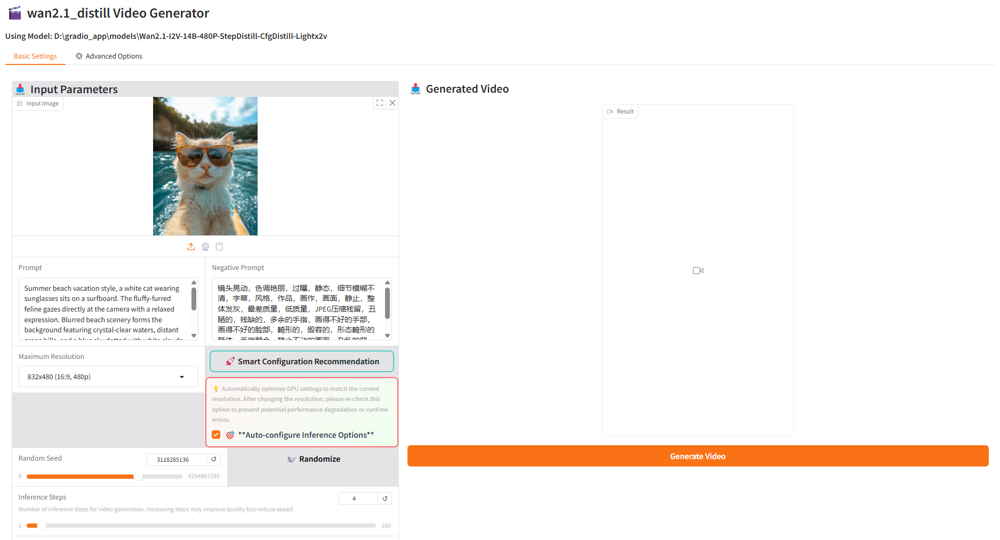

# Windows Local Deployment Guide

## 📖 Overview

This document provides detailed instructions for deploying LightX2V locally on Windows environments, including batch file inference, Gradio Web interface inference, and other usage methods.

## 🚀 Quick Start

### Environment Requirements

#### Hardware Requirements
- **GPU**: NVIDIA GPU, recommended 8GB+ VRAM
- **Memory**: Recommended 16GB+ RAM
- **Storage**: Strongly recommended to use SSD solid-state drives, mechanical hard drives will cause slow model loading


## 🎯 Usage Methods

### Method 1: Using Batch File Inference

Refer to [Quick Start Guide](../getting_started/quickstart.md) to install environment, and use [batch files](https://github.com/ModelTC/LightX2V/tree/main/scripts/win) to run.

### Method 2: Using Gradio Web Interface Inference

#### Manual Gradio Configuration

Refer to [Quick Start Guide](../getting_started/quickstart.md) to install environment, refer to [Gradio Deployment Guide](./deploy_gradio.md)

#### One-Click Gradio Startup (Recommended)

**📦 Download Software Package**
- [Quark Cloud](https://pan.quark.cn/s/f44023dcf8c8)

**📁 Directory Structure**
After extraction, ensure the directory structure is as follows:

```
├── env/                        # LightX2V environment directory
├── LightX2V/                   # LightX2V project directory
├── start_lightx2v.bat          # One-click startup script
├── lightx2v_config.txt         # Configuration file
├── LightX2V使用说明.txt         # LightX2V usage instructions
├── outputs/                    # Generated video save directory
└── models/                     # Model storage directory
```

**⚠️ Note for RTX 50 Series GPU Users**: We provide a dedicated runtime environment. Please download from [Quark Cloud](https://pan.quark.cn/s/52b9a8c8f07a), extract and replace the `env/` directory in the software package.

**📥 Model Download**:

You can directly download from the Gradio frontend, with two download sources provided: HuggingFace and ModelScope. You can choose according to your situation, or refer to the [Model Structure Documentation](../getting_started/model_structure.md) to manually download.


**📋 Configuration Parameters**

Edit the `lightx2v_config.txt` file and modify the following parameters as needed:

```ini

# Interface language (zh: Chinese, en: English)
lang=en

# Server port
port=8032

# GPU device ID (0, 1, 2...)
gpu=0

# Model path
model_path=models/
```

**🚀 Start Service**

Double-click to run the `start_lightx2v.bat` file, the script will:
1. Automatically read configuration file
2. Verify model paths and file integrity
3. Start Gradio Web interface
4. Automatically open browser to access service




**⚠️ Important Notes**:
- **Display Issues**: If the webpage opens blank or displays abnormally, please run `pip install --upgrade gradio` to upgrade the Gradio version.
