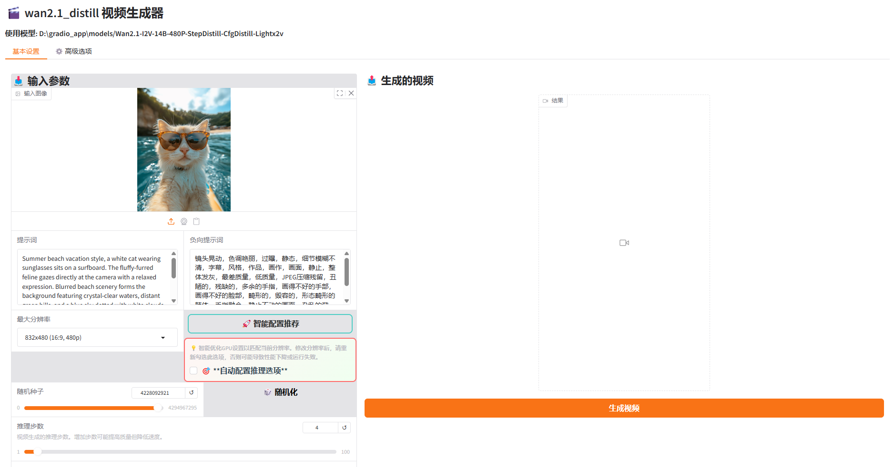
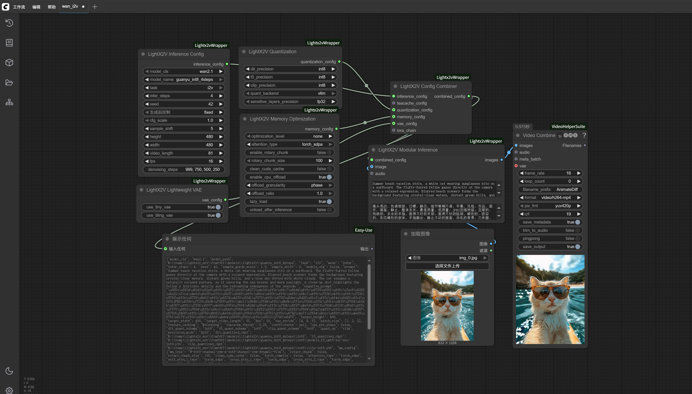

# Windows 本地部署指南

## 📖 概述

本文档将详细指导您在Windows环境下完成LightX2V的本地部署配置，包括批处理文件推理、Gradio Web界面推理等多种使用方式。

## 🚀 快速开始

### 环境要求

#### 硬件要求
- **GPU**: NVIDIA GPU，建议 8GB+ VRAM
- **内存**: 建议 16GB+ RAM
- **存储**: 强烈建议使用 SSD 固态硬盘，机械硬盘会导致模型加载缓慢

## 🎯 使用方式

### 方式一：使用批处理文件推理

参考[快速开始文档](../getting_started/quickstart.md)安装环境，并使用[批处理文件](https://github.com/ModelTC/LightX2V/tree/main/scripts/win)运行。

### 方式二：使用Gradio Web界面推理

#### 手动配置Gradio

参考[快速开始文档](../getting_started/quickstart.md)安装环境，参考[Gradio部署指南](./deploy_gradio.md)

#### 一键启动Gradio（推荐）

**📦 下载软件包**
- [百度云](https://pan.baidu.com/s/14bMAbOuFFSj8yzt4Zdmyqw)
- [夸克网盘](https://pan.quark.cn/s/97b4ad6bc76c)

**📁 目录结构**
解压后，确保目录结构如下：

```
├── env/                        # LightX2V 环境目录
├── LightX2V/                   # LightX2V 项目目录
├── start_lightx2v.bat          # 一键启动脚本
├── lightx2v_config.txt         # 配置文件
├── LightX2V使用说明.txt         # LightX2V使用说明
├── outputs/                    # 生成的视频保存目录
└── models/                     # 模型存放目录
    ├── 说明.txt                       # 模型说明文档
    ├── Wan2.1-I2V-14B-480P-Lightx2v/  # 图像转视频模型（480P）
    ├── Wan2.1-I2V-14B-720P-Lightx2v/  # 图像转视频模型（720P）
    ├── Wan2.1-I2V-14B-480P-StepDistill-CfgDistil-Lightx2v/  # 图像转视频模型（4步蒸馏，480P）
    ├── Wan2.1-I2V-14B-720P-StepDistill-CfgDistil-Lightx2v/  # 图像转视频模型（4步蒸馏，720P）
    ├── Wan2.1-T2V-1.3B-Lightx2v/      # 文本转视频模型（1.3B参数）
    ├── Wan2.1-T2V-14B-Lightx2v/       # 文本转视频模型（14B参数）
    └── Wan2.1-T2V-14B-StepDistill-CfgDistill-Lightx2v/      # 文本转视频模型（4步蒸馏）
```

**📥 下载模型**:

可参考[模型结构文档](./model_structure.md)下载完整模型（包含量化和非量化版本）或仅下载量化/非量化版本。

**下载选项说明**：

- **完整模型**：下载包含量化和非量化版本的完整模型时，在`Gradio` Web前端的高级选项中可以自由选择DIT/T5/CLIP的量化精度。

- **仅非量化版本**：仅下载非量化版本时，在`Gradio` Web前端中，`DIT/T5/CLIP`的量化精度只能选择bf16/fp16。如需使用量化版本的模型，请手动下载量化权重到Gradio启动的`i2v_model_path`或者`t2v_model_path`目录下。

- **仅量化版本**：仅下载量化版本时，在`Gradio` Web前端中，`DIT/T5/CLIP`的量化精度只能选择fp8或int8（取决于您下载的权重）。如需使用非量化版本的模型，请手动下载非量化权重到Gradio启动的`i2v_model_path`或者`t2v_model_path`目录下。

- **注意**：无论是下载了完整模型还是部分模型，`i2v_model_path` 和 `t2v_model_path` 参数的值都应该是一级目录的路径。例如：`Wan2.1-I2V-14B-480P-Lightx2v/`，而不是 `Wan2.1-I2V-14B-480P-Lightx2v/int8`。

**📋 配置参数**

编辑 `lightx2v_config.txt` 文件，根据需要修改以下参数：

```ini
# 任务类型 (i2v: 图像转视频, t2v: 文本转视频)
task=i2v

# 界面语言 (zh: 中文, en: 英文)
lang=zh

# 服务器端口
port=8032

# GPU设备ID (0, 1, 2...)
gpu=0

# 模型大小 (14b: 14B参数模型, 1.3b: 1.3B参数模型)
model_size=14b

# 模型类别 (wan2.1: 标准模型, wan2.1_distill: 蒸馏模型)
model_cls=wan2.1

# 图像转视频模型路径
i2v_model_path=models/Wan2.1-I2V-14B-480P-StepDistill-CfgDistill-Lightx2v

# 文本转视频模型路径
t2v_model_path=models/Wan2.1-T2V-1.3B-Lightx2v
```

**⚠️ 重要提示**: 如果使用蒸馏模型（模型名称包含StepDistill-CfgDistil字段），请将`model_cls`设置为`wan2.1_distill`

**🚀 启动服务**

双击运行 `start_lightx2v.bat` 文件，脚本将：
1. 自动读取配置文件
2. 验证模型路径和文件完整性
3. 启动 Gradio Web 界面
4. 自动打开浏览器访问服务

**💡 使用建议**: 当打开Gradio Web页面后，建议勾选"自动配置推理选项"，系统会自动选择合适的优化配置针对您的机器。当重新选择分辨率后，也需要重新勾选"自动配置推理选项"。



**⚠️ 重要提示**:
- **首次运行**: 系统会自动解压环境文件 `env.zip`，此过程需要几分钟时间，请耐心等待。后续启动无需重复此步骤。
- **加速启动**: 您也可以手动解压 `env.zip` 文件到当前目录以节省首次启动时间。
- **页面显示问题**: 如果网页打开空白或显示异常，请运行 `pip install --upgrade gradio` 升级Gradio版本。


### 方式三：使用ComfyUI推理

此说明将指导您如何下载与使用便携版的Lightx2v-ComfyUI环境，如此可以免去手动配置环境的步骤，适用于想要在Windows系统下快速开始体验使用Lightx2v加速视频生成的用户。

#### 下载Windows便携环境：

- [百度网盘下载](https://pan.baidu.com/s/1FVlicTXjmXJA1tAVvNCrBw?pwd=wfid)，提取码：wfid

便携环境中已经打包了所有Python运行相关的依赖，也包括ComfyUI和LightX2V的代码及其相关依赖，下载后解压即可使用。

解压后对应的文件目录说明如下：

```shell
lightx2v_env
├──📂 ComfyUI                    # ComfyUI代码
├──📂 portable_python312_embed   # 独立的Python环境
└── run_nvidia_gpu.bat            # Windows启动脚本（双击启动）
```

#### 启动ComfyUI

直接双击run_nvidia_gpu.bat文件，系统会打开一个Command Prompt窗口并运行程序，一般第一次启动时间会比较久，请耐心等待，启动完成后会自动打开浏览器并出现ComfyUI的前端界面。



LightX2V-ComfyUI的插件使用的是，[ComfyUI-Lightx2vWrapper](https://github.com/ModelTC/ComfyUI-Lightx2vWrapper)，示例工作流可以从此项目中获取。

#### 已测试显卡（offload模式）

- 测试模型`Wan2.1-I2V-14B-480P`

| 显卡型号   | 任务类型     | 显存容量    | 实际最大显存占用 | 实际最大内存占用 |
|:----------|:-----------|:-----------|:--------    |:----------    |
| 3090Ti    | I2V        | 24G        | 6.1G        | 7.1G          |
| 3080Ti    | I2V        | 12G        | 6.1G        | 7.1G          |
| 3060Ti    | I2V        | 8G         | 6.1G        | 7.1G          |
| 4070Ti Super    | I2V        | 16G         | 6.1G        | 7.1G          |
| 4070    | I2V        | 12G         | 6.1G        | 7.1G          |
| 4060    | I2V        | 8G         | 6.1G        | 7.1G          |


#### 环境打包和使用参考
- [ComfyUI](https://github.com/comfyanonymous/ComfyUI)
- [Portable-Windows-ComfyUI-Docs](https://docs.comfy.org/zh-CN/installation/comfyui_portable_windows#portable-%E5%8F%8A%E8%87%AA%E9%83%A8%E7%BD%B2)
