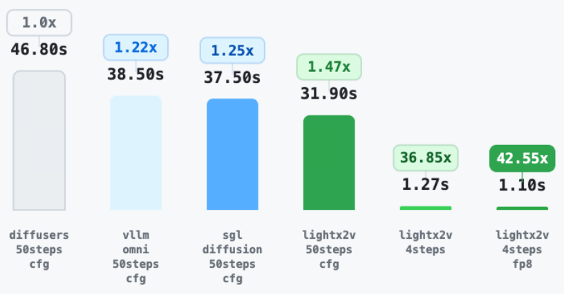

# Qwen Image Examples

This directory contains usage examples for Qwen Image and Qwen Image Edit models.

## Benchmark Results

DiT inference time comparison (excluding warmup time, data updated on 2025.12.23):

<div align="center">
  
</div>


## Model Download

Before using the example scripts, you need to download the corresponding models. All models can be downloaded from the following addresses:

Text-to-Image Models (2512 is the latest model)
- [Qwen-Image-2512](https://huggingface.co/Qwen/Qwen-Image-2512)
- [Qwen-Image-2512-Lightning](https://huggingface.co/lightx2v/Qwen-Image-2512-Lightning)

Image Editing Models (2511 is the latest model)
- [Qwen-Image-Edit-2511](https://huggingface.co/Qwen/Qwen-Image-Edit-2511)
- [LightX2V-Qwen-Image-Edit-2511](https://huggingface.co/lightx2v/Qwen-Image-Edit-2511-Lightning)


## Usage Method 1: Using Bash Scripts (Highly Recommended)

For environment setup, we recommend using our Docker image. Please refer to [quickstart](https://lightx2v-en.readthedocs.io/en/latest/getting_started/quickstart.html)

```
git clone https://github.com/ModelTC/LightX2V.git
cd LightX2V/scripts/qwen_image

# Before running the scripts below, you need to replace lightx2v_path and model_path in the scripts with actual paths
# For example: export lightx2v_path=/home/user/LightX2V
# For example: export model_path=/home/user/models/Qwen-Image-Edit-2511
```

Text-to-Image Models
```
# Inference with 2512 text-to-image original model, default is 50 steps
bash qwen_image_t2i_2512.sh

# Inference with 2512 text-to-image step-distilled model, default is 8 steps, requires downloading LoRA model, then modify the lora_configs path in config_json file
bash qwen_image_t2i_2512_lora.sh

# Inference with 2512 text-to-image step-distilled + FP8 quantized model, default is 8 steps, requires downloading FP8 quantized model, then modify the dit_quantized_ckpt path in config_json file
bash qwen_image_t2i_2512_distill_fp8.sh
```

Image Editing Models
```
# Inference with 2511 image editing original model, default is 40 steps
bash qwen_image_i2i_2511.sh

# Inference with 2511 image editing step-distilled model, default is 8 steps, requires downloading LoRA model, then modify the lora_configs path in config_json file
bash qwen_image_i2i_2511_lora.sh

# Inference with 2511 image editing step-distilled + FP8 quantized model, default is 8 steps, requires downloading FP8 quantized model, then modify the dit_quantized_ckpt path in config_json file
bash qwen_image_i2i_2511_distill_fp8.sh
```

## Usage Method 2: Install and Use Python Scripts

For environment setup, we recommend using our Docker image. Please refer to [quickstart](https://lightx2v-en.readthedocs.io/en/latest/getting_started/quickstart.html)

First, clone the repository and install dependencies:

```bash
git clone https://github.com/ModelTC/LightX2V.git
cd LightX2V
pip install -v -e .
```

Running Step-Distilled + FP8 Quantized Model

Run the `qwen_2511_fp8.py` script, which uses a model optimized with step distillation and FP8 quantization:

```bash
cd examples/qwen_image/
python qwen_2511_fp8.py
```

This approach reduces inference steps through step distillation technology while using FP8 quantization to reduce model size and memory footprint, achieving faster inference speed.

Running Qwen-Image-Edit-2511 Model + Distilled LoRA

Run the `qwen_2511_with_distill_lora.py` script, which uses the Qwen-Image-Edit-2511 base model with distilled LoRA:

```bash
cd examples/qwen_image/
python qwen_2511_with_distill_lora.py
```

This approach uses the complete Qwen-Image-Edit-2511 model and optimizes it through distilled LoRA, improving inference efficiency while maintaining model performance.
