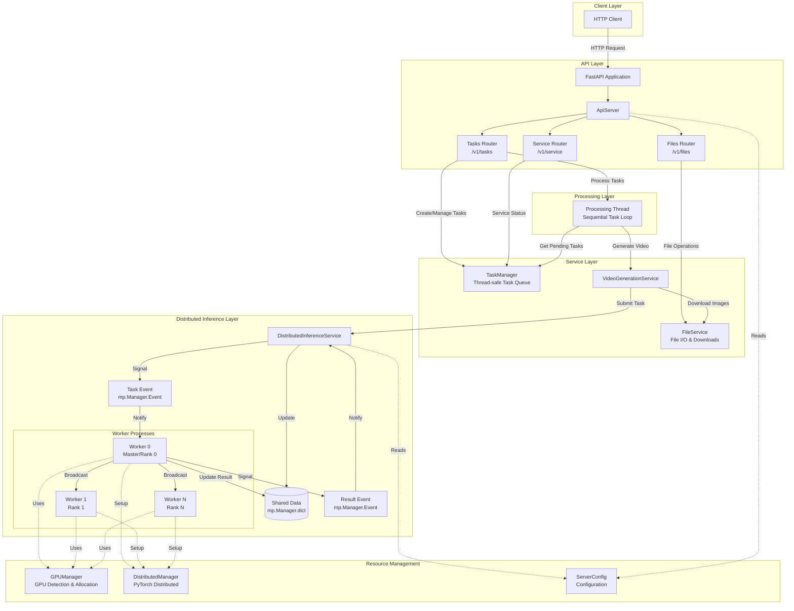
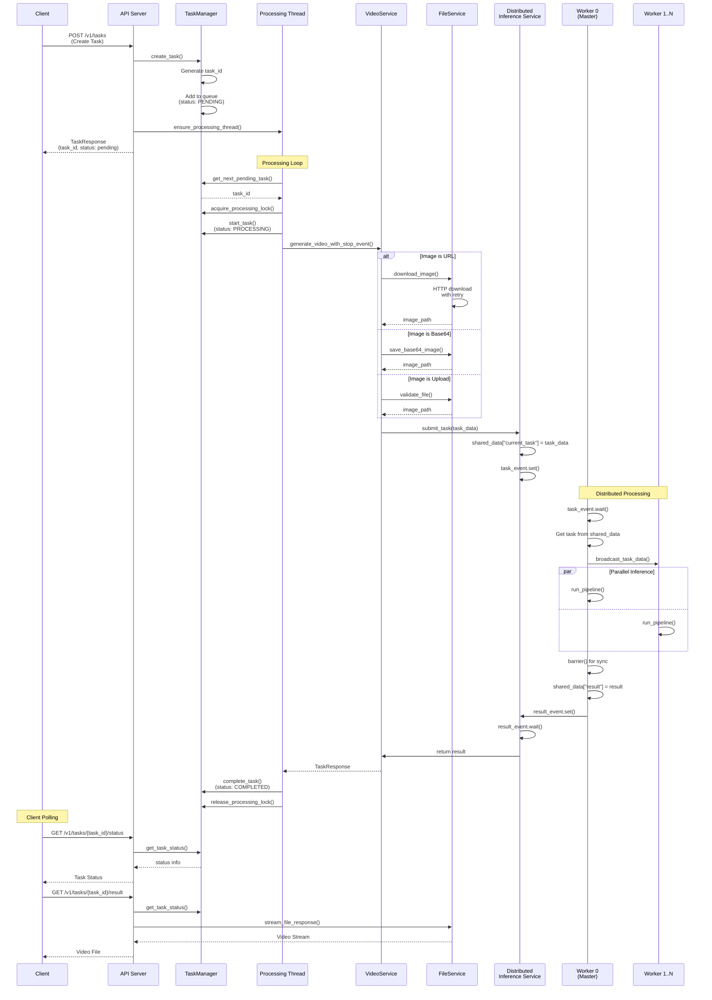
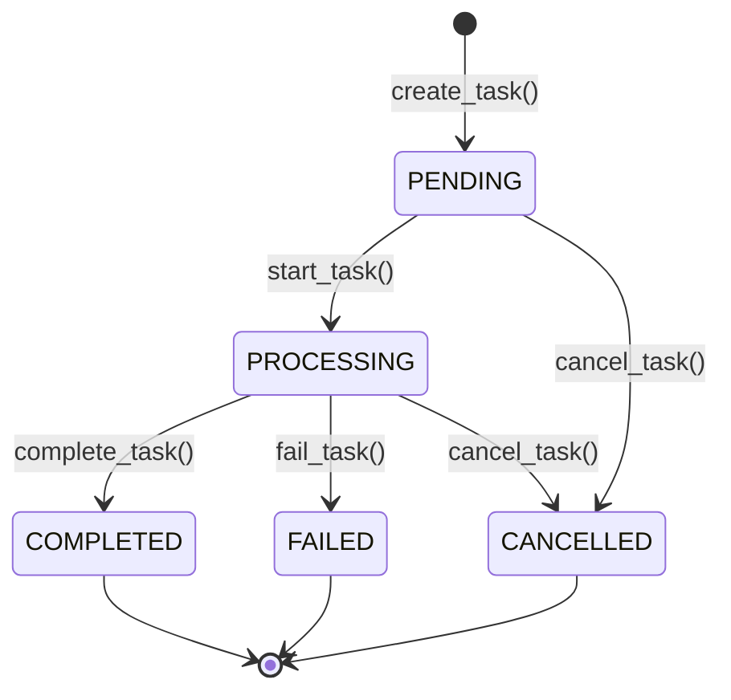

# LightX2V Server

## Overview

The LightX2V server is a distributed video generation service built with FastAPI that processes image-to-video tasks using a multi-process architecture with GPU support. It implements a sophisticated task queue system with distributed inference capabilities for high-throughput video generation workloads.

## Architecture

### System Architecture



## Task Processing Flow



## Task States



## Configuration

### Environment Variables

see `lightx2v/server/config.py`

### Command Line Arguments

```bash
python -m lightx2v.server.main \
    --model_path /path/to/model \
    --model_cls wan2.1_distill \
    --task i2v \
    --host 0.0.0.0 \
    --port 8000 \
    --config_json /path/to/xxx_config.json
```

```bash
python -m lightx2v.server.main \
    --model_path /path/to/model \
    --model_cls wan2.1_distill \
    --task i2v \
    --host 0.0.0.0 \
    --port 8000 \
    --config_json /path/to/xxx_dist_config.json \
    --nproc_per_node 2
```

## Key Features

### 1. Distributed Processing

- **Multi-process architecture** for GPU parallelization
- **Master-worker pattern** with rank 0 as coordinator
- **PyTorch distributed** backend (NCCL for GPU, Gloo for CPU)
- **Automatic GPU allocation** across processes
- **Task broadcasting** with chunked pickle serialization

### 2. Task Queue Management

- **Thread-safe** task queue with locks
- **Sequential processing** with single processing thread
- **Configurable queue limits** with overflow protection
- **Task prioritization** (FIFO)
- **Automatic cleanup** of old completed tasks
- **Cancellation support** for pending and running tasks

### 3. File Management

- **Multiple input formats**: URL, base64, file upload
- **HTTP downloads** with exponential backoff retry
- **Streaming responses** for large video files
- **Cache management** with automatic cleanup
- **File validation** and format detection

## Performance Considerations

1. **Single Task Processing**: Tasks are processed sequentially to manage GPU memory effectively
2. **Multi-GPU Support**: Distributes inference across available GPUs for parallelization
3. **Connection Pooling**: Reuses HTTP connections to reduce overhead
4. **Streaming Responses**: Large files are streamed to avoid memory issues
5. **Queue Management**: Automatic task cleanup prevents memory leaks
6. **Process Isolation**: Distributed workers run in separate processes for stability

## Monitoring and Debugging

### Logging

The server uses `loguru` for structured logging. Logs include:

- Request/response details
- Task lifecycle events
- Worker process status
- Error traces with context

### Health Checks

- `/v1/service/status` - Overall service health
- `/v1/tasks/queue/status` - Queue status and processing state
- Process monitoring via system tools (htop, nvidia-smi)

### Common Issues

1. **GPU Out of Memory**: Reduce `nproc_per_node` or adjust model batch size
2. **Task Timeout**: Increase `LIGHTX2V_TASK_TIMEOUT` for longer videos
3. **Queue Full**: Increase `LIGHTX2V_MAX_QUEUE_SIZE` or add rate limiting

## Security Considerations

1. **Input Validation**: All inputs validated with Pydantic schemas

## License

See the main project LICENSE file for licensing information.
